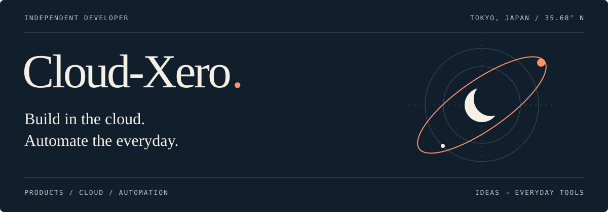

  

  <a href="#01--about">About</a> &nbsp; / &nbsp;
  <a href="#02--selected-products">Products</a> &nbsp; / &nbsp;
  <a href="#03--core-stack">Core Stack</a> &nbsp; / &nbsp;
  <a href="#04--open-source">Open Source</a>

 

## 01 / About

### Small ideas. Useful products.

I'm a full-stack developer based in **Tokyo, Japan**, building personal products and tools that make everyday work easier. I connect long-term goals to daily actions, explore AI and digital transformation, and turn parenting moments into something worth sharing.

My focus is **cloud-native development**, **AI-powered workflows**, and **knowledge tools** — from serverless applications to reusable development skills and Obsidian plugins.

 

## 02 / Selected Products

<table>
  <tr>
    <td width="33%" valign="top">
      01 &nbsp; / &nbsp; GOAL MANAGEMENT
      <h3><a href="https://abstria.app/">Abstria ↗</a></h3>
      
<strong>Big goals, daily steps.</strong>

      
Connect long-term goals to concrete action through a year / month / week / day hierarchy.

       
      <a href="https://abstria.app/">Explore Abstria →</a>
    </td>
    <td width="33%" valign="top">
      02 &nbsp; / &nbsp; TECH MEDIA
      <h3><a href="https://apsis-dx.com/">Apsis ↗</a></h3>
      
<strong>Technology in context.</strong>

      
Explore the intersection of AI, digital transformation, and business through tech media.

       
      <a href="https://apsis-dx.com/">Read Apsis →</a>
    </td>
    <td width="33%" valign="top">
      03 &nbsp; / &nbsp; PARENTING
      <h3><a href="https://piyorepo.com/">PiyoRepo ↗</a></h3>
      
<strong>Little moments, shared.</strong>

      
Turn everyday childcare logs into cards you can share on social media.

       
      <a href="https://piyorepo.com/">Try PiyoRepo →</a>
    </td>
  </tr>
</table>

 

## 03 / Core Stack

  
  
  
  
  
  

 

## 04 / Open Source

**[ai-plugins ↗](https://github.com/Cloud-Xero/ai-plugins)** &nbsp; AI WORKFLOWS 
A versioned, installable collection of Claude Code plugins and skills.

**[obsidian-background-slideshow ↗](https://github.com/Cloud-Xero/obsidian-background-slideshow)** &nbsp; KNOWLEDGE TOOLS 
Background slideshows with smooth fade transitions for Obsidian.

**[my-setting ↗](https://github.com/Cloud-Xero/my-setting)** &nbsp; DEVELOPER ENVIRONMENT 
Configuration files for a reproducible development setup.

 

## 05 / Contributions

<picture>
  <source media="(prefers-color-scheme: dark)" srcset="https://raw.githubusercontent.com/Cloud-Xero/Cloud-Xero/output/github-contribution-grid-snake-dark.svg" />
  <source media="(prefers-color-scheme: light)" srcset="https://raw.githubusercontent.com/Cloud-Xero/Cloud-Xero/output/github-contribution-grid-snake.svg" />
  
</picture>

 

---

  <strong>Let's build something useful.</strong> 
  Open to collaboration on web products, developer tools, and workflow automation.  
  <a href="https://github.com/Cloud-Xero">GitHub ↗</a> &nbsp; · &nbsp; Tokyo, Japan

